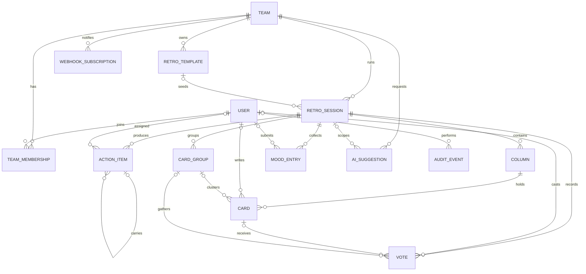

# Team Retrospective Web App Specification

- Status: draft for implementation
- Last updated: 2026-08-18
- Language: English

This document specifies an internal web application for running team
retrospectives and tracking their outcomes over time. It is the single
normative document: there is no second language version of it, and there
is deliberately no plan for one. Two normative documents can disagree,
and a specification that disagrees with itself is worse than one written
in a language some readers have to work at. The interface is Thai first;
the specification is not.

## Table of Contents

1. Overview
2. Conventions
3. Roles and Permissions
4. Functional Requirements
5. AI Module
6. Data Model
7. API and Integration Guidelines
8. UI and UX Requirements
9. Non-Functional Requirements
10. Acceptance Criteria
11. Assumptions and Key Decisions
12. Out of Scope and Future Ideas

## 1. Overview

### 1.1 Purpose

The app helps teams inside one organization run structured
retrospectives: collect reflections, discuss what matters most, agree
on actions, and see whether those actions get done. It aims to give
teams insight over time, not only a board of sticky notes.

### 1.2 Goals

- Make retros easy to run well, with or without an experienced
  facilitator.
- Support psychological safety through blind and anonymous modes.
- Turn discussion into tracked action items that carry over between
  sessions until they are resolved.
- Build longitudinal team health data: mood, participation, action
  completion, and meeting value.
- Work equally well on desktop and mobile browsers, in Thai (the
  default) and English, in light and dark themes.

### 1.3 Scope

In scope: a single-organization web application with teams, live
retrospective sessions, action tracking, history and insights,
exports, outbound webhooks, and an optional AI assistance module.

Out of scope items are listed in section 12.

### 1.4 Personas

- **Org Admin** — operates the deployment: users, org settings,
  retention, audit.
- **Team Lead** — owns one or more teams: membership, team settings,
  webhooks.
- **Member** — participates in retros and works on action items.
- **Facilitator** — a per-session designation, not an org role. The
  session creator facilitates by default and can hand the role to
  any participant at any time (see FR-207).

### 1.5 Glossary

The Thai file uses the terms below. Terms marked "loanword" stay in
English in Thai text, matching common Thai agile usage.

| English term | Thai term used in the Thai file |
| --- | --- |
| Retrospective (retro) | Retrospective (loanword) |
| Facilitator | Facilitator (loanword) |
| Sprint | Sprint (loanword) |
| Template | Template (loanword) |
| Card | การ์ด |
| Column | คอลัมน์ |
| Check-in | เช็กอิน |
| Blind mode | โหมดซ่อนการ์ด |
| Anonymous mode | โหมดไม่ระบุตัวตน |
| Vote budget | โควตาโหวต |
| Action item | รายการติดตามผล |
| Carry-over | การยกยอด |
| ROTI | ROTI (คะแนนความคุ้มค่าของเวลา) |
| Mood score | คะแนนอารมณ์ |
| Recap | สรุปผลย้อนหลัง |
| Insights | ข้อมูลเชิงลึก |

## 2. Conventions

### 2.1 Requirement Keywords

The key words MUST, MUST NOT, SHOULD, SHOULD NOT, and MAY are used as
described in [RFC 2119](https://www.rfc-editor.org/rfc/rfc2119). The
Thai file maps them as ต้อง = MUST, ต้องไม่ = MUST NOT, ควร = SHOULD,
ไม่ควร = SHOULD NOT, and อาจ = MAY.

### 2.2 Requirement Identifiers

- Requirement IDs use the pattern FR-nnn, NFR-nnn, or AI-nnn with
  three digits. IDs are stable: numbering gaps are allowed and IDs
  are never renumbered.
- FR-001 to FR-099: users and authentication (section 4.1).
- FR-101 to FR-199: teams and membership (section 4.2).
- FR-201 to FR-299: sessions and phases (section 4.3).
- FR-301 to FR-399: board and cards (section 4.4).
- FR-401 to FR-499: voting and discussion (section 4.5).
- FR-501 to FR-599: action items (section 4.6).
- FR-601 to FR-699: history and insights (section 4.7).
- FR-701 to FR-799: export and webhooks (section 4.8).
- FR-801 to FR-899: administration (section 4.9).
- FR-901 to FR-999: UI and UX (section 8).
- NFR-101 to NFR-699: non-functional requirements (section 9).
- AI-001 to AI-099: AI module (section 5).
- SCR-01 to SCR-13 label the screens in section 8.1. They are
  inventory labels, not normative requirements.

### 2.3 Shared Content Rules

- Requirement IDs, entity and field names, API paths, event names,
  and all fenced code blocks are written in English in both language
  files. Fenced blocks are identical byte for byte across the two
  files.
- Dates and times in payloads use ISO 8601; see section 7.1.
- The spec is technology neutral: any language, framework,
  datastore, or realtime transport may be used as long as every
  requirement holds.

## 3. Roles and Permissions

### 3.1 Organization and Team Actions

Team Lead and Member are per-team roles; Org Admin is an org-level
flag on the user. Team Lead rights apply only inside teams the user
leads.

| Action | Org Admin | Team Lead | Member |
| --- | --- | --- | --- |
| Create a team | Yes | Yes | Yes |
| Manage team members | Yes | Yes | No |
| Edit team settings | Yes | Yes | No |
| Create a session | Yes | Yes | Yes |
| View team insights | Yes | Yes | Yes |
| View org-wide insights | Yes | No | No |
| Manage webhooks | Yes | Yes | No |
| Toggle team AI opt-in | Yes | Yes | No |
| Manage users and org settings | Yes | No | No |
| Purge data and view audit log | Yes | No | No |

### 3.2 In-Session Controls

| Control | Facilitator | Participant |
| --- | --- | --- |
| Advance, revert, or skip a phase | Yes | No |
| Start, pause, or reset the timer | Yes | No |
| Reveal cards and votes | Yes | No |
| Set or clear the focused topic | Yes | No |
| Edit discussion notes | Yes | No |
| Delete any card | Yes | Own cards only |
| Transfer the facilitator role | Yes | No |
| Close the session | Yes | No |

### 3.3 Additional Access Rules

- Users see only teams they belong to; Org Admin additionally sees
  org-wide aggregates but never anonymous authorship (see NFR-304).
- Anyone who creates a team becomes its Team Lead (see FR-101).
- Every permission in this section MUST be enforced server side on
  every request and realtime message (see NFR-201).

## 4. Functional Requirements

### 4.1 Users and Authentication

- **FR-001**: The system MUST provide email and password sign-in as
  the baseline authentication method.
- **FR-002**: Authentication MUST be pluggable so a deployment can
  replace or extend the baseline with an identity provider. The
  design SHOULD be compatible with OpenID Connect.
- **FR-003**: Each user MUST have a profile with display name,
  optional avatar, preferred language (th or en, default th), and
  theme preference (light, dark, or system).
- **FR-004**: The system MUST support a password reset flow for the
  baseline method.
- **FR-005**: An Org Admin MUST be able to deactivate a user.
  Deactivated users cannot sign in; their sessions are revoked (see
  NFR-206) and their content is retained per the retention policy.

### 4.2 Teams and Membership

- **FR-101**: Any user MUST be able to create a team with a name and
  an optional description, becoming its Team Lead.
- **FR-102**: Team Leads MUST be able to add and remove members and
  set each member's per-team role (lead or member).
- **FR-103**: A user MAY belong to any number of teams and MUST see
  only teams they belong to (see 3.3).
- **FR-104**: A member MUST be able to leave a team.
- **FR-105**: Team settings MUST include the default template, the
  default vote budget, and the AI opt-in toggle (see AI-003).
- **FR-106**: Team Leads MUST be able to archive a team. Archived
  teams are read-only and keep their history until purged.

### 4.3 Sessions and Phases

A session moves through six ordered phases:

1. Check-in
2. Brainstorm
3. Group
4. Vote
5. Discuss
6. Wrap-up

- **FR-201**: Any team member MUST be able to create a session from
  a built-in template (Start-Stop-Continue, Mad-Sad-Glad, 4Ls, KPT,
  or Sailboat as columns) or from a team template.
- **FR-202**: Users MUST be able to define custom templates with two
  to six columns (each with a name and an optional hint) and save
  them for team reuse.
- **FR-203**: A session MAY have a scheduled start time; team pages
  MUST list upcoming and past sessions.
- **FR-204**: Participants MUST be able to join an active session
  via a short link or join code. Only signed-in members of the
  session's team can join.
- **FR-205**: A session MUST move through the lifecycle created,
  active, closed. Closed sessions are read-only except action items
  (see FR-503).
- **FR-206**: The facilitator MUST control phase transitions,
  including skipping a phase and reverting to the previous one, and
  every participant's view MUST follow in realtime.
- **FR-207**: The session creator is the facilitator by default and
  MUST be able to transfer the role to any participant. If the
  facilitator disconnects for more than 60 seconds, the system MUST
  offer the role to the remaining participants.
- **FR-208**: The facilitator MUST be able to run a countdown timer
  (start, pause, reset) that all participants see in sync.
- **FR-209**: When blind mode is on, cards created during brainstorm
  are visible only to their author until the facilitator reveals
  all cards.
- **FR-210**: When anonymous mode is enabled at creation, card and
  vote authorship MUST be hidden from everyone including the
  facilitator and Org Admin, and the mode cannot be turned off
  after the session starts.
- **FR-211**: Check-in MUST collect a mood score from 1 to 5 with an
  optional one-word note, and show only aggregates to participants.
- **FR-212**: The check-in MAY show an icebreaker prompt drawn from
  a built-in bank (AI-generated prompts: see AI-013).
- **FR-213**: Participants MUST be able to mark themselves ready in
  the current phase; the facilitator sees the ready count live.
- **FR-214**: Wrap-up MUST offer a one-tap ROTI poll from 1 to 5;
  aggregates feed team insights (see FR-604).
- **FR-215**: When the facilitator closes the session, the system
  MUST generate the recap page (see FR-602).

### 4.4 Board and Cards

- **FR-301**: During brainstorm, participants MUST be able to create
  cards in any column, and edit or delete their own cards. Card
  text is limited to 500 characters with a live counter.
- **FR-302**: The facilitator MUST be able to delete any card.
- **FR-303**: Cards MUST be movable between columns by drag and drop
  and by an equivalent tap-based menu (see FR-903).
- **FR-304**: During the group phase, participants MUST be able to
  merge related cards into a labeled group and ungroup them again.
- **FR-305**: Card order within a column MUST be shared: every
  participant sees the same order.
- **FR-306**: All board changes MUST propagate to all participants
  in realtime within the latency target NFR-102.
- **FR-307**: The board MUST show presence: who is currently in the
  session and their ready state (see FR-213).
- **FR-308**: Concurrent edits resolve as last write wins; the UI
  SHOULD reduce collisions with presence cues (see section 11).
- **FR-309**: After a disconnect, a client MUST resync with a full
  snapshot followed by incremental events (see 7.3).

### 4.5 Voting and Discussion

- **FR-401**: Each participant MUST get a vote budget, configurable
  per session (team default per FR-105, initial value 5).
- **FR-402**: A session setting MUST control whether one participant
  can put more than one vote on the same card or group.
- **FR-403**: During the vote phase, participants MUST be able to
  cast and retract votes and see their own remaining budget live.
- **FR-404**: Vote totals MUST stay hidden until the facilitator
  reveals them; after reveal, totals are visible to everyone.
- **FR-405**: The discuss phase MUST present topics (cards or
  groups) sorted by votes, highest first, ties broken by creation
  time.
- **FR-406**: The facilitator MUST be able to set the focused topic;
  every participant's view follows the focus in realtime.
- **FR-407**: The facilitator MUST be able to record a discussion
  note per topic; notes appear in the recap and are searchable.
- **FR-408**: The facilitator MAY run the timer per topic to timebox
  discussion (uses FR-208).

### 4.6 Action Items

- **FR-501**: During discuss and wrap-up, participants MUST be able
  to create action items, optionally linked to the focused topic.
- **FR-502**: An action item MUST have a title and a status (open,
  in progress, done, dropped), and MAY have a description, an
  assignee from the team, and a due date.
- **FR-503**: Team members MUST be able to update action items at
  any time, including after the session closes.
- **FR-504**: Each team MUST have an action list view filterable by
  status, assignee, and originating session.
- **FR-505**: When a new session starts, the check-in phase MUST
  present the team's open action items for a quick status update
  before brainstorming begins. Items still open MAY be carried
  over, keeping a link to the item they were carried from.
- **FR-506**: Action completion counts and aging MUST feed the team
  insights dashboard (see FR-604).

### 4.7 History and Insights

- **FR-601**: Each team MUST have an archive listing closed sessions
  with date, template, participant count, and mood summary.
- **FR-602**: Every closed session MUST have a read-only recap page:
  columns and cards, groups, vote totals, discussion notes, action
  items, and mood and ROTI aggregates.
- **FR-603**: Users MUST be able to search their team's past cards,
  discussion notes, and action items by keyword.
- **FR-604**: Each team MUST have an insights dashboard showing mood
  trend, participation rate, cards per session, action completion
  rate and aging, and ROTI trend across sessions.
- **FR-605**: Org Admin MUST have an org-wide view of aggregated,
  anonymized metrics only: no per-person data and no card text.
- **FR-606**: For anonymous sessions, per-person statistics MUST be
  suppressed everywhere; only aggregates appear.

### 4.8 Export and Webhooks

- **FR-701**: Users MUST be able to export a closed session's recap
  as a markdown file.
- **FR-702**: Users MUST be able to export cards and action items as
  CSV.
- **FR-703**: The system MUST offer a full-session JSON export
  containing everything in the recap plus metadata.
- **FR-704**: A team MAY configure one outbound webhook (URL and
  shared secret) subscribed to session.started, session.closed, and
  action.due events.
- **FR-705**: Webhook deliveries MUST carry an HMAC signature header
  computed with the shared secret (see 7.4).
- **FR-706**: Failed deliveries MUST be retried with exponential
  backoff and recorded in a delivery log visible to the Team Lead.

### 4.9 Administration

- **FR-801**: Org Admin MUST be able to list users, deactivate them
  (FR-005), and reassign team leadership.
- **FR-802**: Org settings MUST include the default language
  (default th), default vote budget, retention period, and feature
  toggles.
- **FR-803**: The system MUST enforce the retention policy by
  purging closed sessions older than the configured period on a
  schedule.
- **FR-804**: Org Admin MUST be able to purge a specific session or
  team on demand after an explicit confirmation; purges are
  audited.
- **FR-805**: To satisfy PDPA erasure requests, Org Admin MUST be
  able to erase or anonymize one user's personal data while keeping
  de-identified team aggregates (see NFR-303).
- **FR-806**: Feature toggles MUST include a global AI kill switch
  that immediately disables all AI features (see AI-003) and a
  global webhook disable.
- **FR-807**: Admin and destructive actions MUST be written to an
  audit log viewable by Org Admin: who, what, when, and target.

## 5. AI Module

### 5.1 Principles

- **AI-001**: The AI module is optional. Every feature outside this
  section MUST work fully with AI disabled or unavailable.
- **AI-002**: AI output is always a suggestion. A human MUST review
  and accept, edit, or reject it; nothing is applied automatically.
- **AI-003**: AI runs only when the team has opted in (FR-105) and
  the global kill switch (FR-806) is off.
- **AI-004**: AI calls go through a provider-agnostic adapter
  interface so deployments can swap providers without app changes.

### 5.2 Adapter Contract

- **AI-005**: AI work MUST run as asynchronous server-side jobs with
  a typed request and response envelope; the UI polls or receives
  an event when a suggestion is ready.
- **AI-006**: Each job MUST have a timeout and a concurrency cap. On
  failure or timeout the feature degrades gracefully: the core flow
  continues and the suggestion slot shows a retry option.

A suggestion envelope looks like this:

```json
{
  "id": "sug_01h9x",
  "type": "session_summary",
  "team_id": "team_42",
  "session_id": "ses_204",
  "status": "ready",
  "input_scope": ["cards", "groups", "votes", "notes"],
  "output": {
    "format": "markdown",
    "content": "## Summary ..."
  },
  "created_at": "2026-08-18T09:30:00Z"
}
```

### 5.3 Reference Adapter: Claude Code CLI

- **AI-007**: The reference adapter invokes the Claude Code CLI in
  non-interactive mode on the server: prompt in, JSON out, parsed
  into the envelope above. Browsers never call AI directly.
- **AI-008**: The adapter MUST run the CLI in a sandboxed working
  directory with credentials from the server environment, no tool
  permissions beyond reading the prepared input file, and the
  timeout from AI-006.

An indicative invocation:

```text
claude -p "$(cat job-prompt.txt)" --output-format json > result.json
```

### 5.4 AI Features

- **AI-009**: Session summary: draft a structured recap (themes,
  decisions, actions) in the session's language for facilitator
  review before it is attached to the recap page.
- **AI-010**: Clustering suggestions: during the group phase,
  suggest which cards look similar; the facilitator applies or
  ignores each suggested group.
- **AI-011**: Action drafting: from the focused topic and its
  discussion note, draft a clear action item; a participant edits
  and confirms it before it is saved.
- **AI-012**: Recurring themes: across a team's past sessions, point
  out topics that keep coming back, with links to the sessions
  where they appeared.
- **AI-013**: Icebreakers: generate check-in prompts appropriate for
  the team's language setting (see FR-212).
- **AI-014**: Translation assist: translate a card or recap between
  Thai and English on request, marked as machine translated.

### 5.5 AI Privacy Rules

- **AI-015**: Jobs MUST send only the content needed for the task:
  the named session's cards, groups, votes, and notes, or the recap
  fields for cross-session analysis.
- **AI-016**: Authorship MUST never be sent for anonymous sessions,
  and SHOULD be omitted for all AI jobs.
- **AI-017**: AI requests and responses MUST be logged with content
  redacted, keeping type, timing, size, and outcome for operations.
- **AI-018**: Stored suggestions follow the same retention and purge
  rules as their team's sessions (FR-803, FR-804).

## 6. Data Model

### 6.1 Modeling Principles

- Every entity has an opaque unique id plus created_at and
  updated_at timestamps; these are omitted from the field lists
  below.
- Types are technology neutral: string, text, int, boolean, enum,
  timestamp, json, list, and ref (a reference to another entity).
- Soft delete exists only where retention requires it; everything
  else deletes hard within the rules in 6.4.

### 6.2 Entity Relationship Diagram

ORG_SETTINGS is a singleton and appears only in 6.3.



### 6.3 Entities

- **USER** — a person who can sign in.
  - Fields: email (string, unique), display_name (string),
    avatar_url (string, optional), language (enum: th, en),
    theme (enum: light, dark, system), is_org_admin (boolean),
    is_active (boolean).
- **TEAM** — a group that runs retros together.
  - Fields: name (string), description (text, optional),
    is_archived (boolean), default_template (ref, optional),
    default_vote_budget (int), ai_opt_in (boolean).
- **TEAM_MEMBERSHIP** — links a user to a team.
  - Fields: user (ref), team (ref), role (enum: lead, member).
- **RETRO_TEMPLATE** — a reusable column layout.
  - Fields: team (ref, optional for built-ins), name (string),
    columns (list of name and hint), is_builtin (boolean).
- **RETRO_SESSION** — one retrospective meeting.
  - Fields: team (ref), template (ref, optional), title (string),
    scheduled_at (timestamp, optional), state (enum: created,
    active, closed), phase (enum: checkin, brainstorm, group,
    vote, discuss, wrapup), is_anonymous (boolean), is_blind
    (boolean), vote_budget (int), multi_vote (boolean), join_code
    (string), facilitator (ref), closed_at (timestamp, optional).
- **COLUMN** — one board column in a session.
  - Fields: session (ref), name (string), hint (string, optional),
    position (int).
- **CARD** — one reflection written by a participant.
  - Fields: column (ref), author (ref, optional; see 6.4), text
    (text, max 500), position (int), card_group (ref, optional).
- **CARD_GROUP** — a labeled cluster of similar cards.
  - Fields: session (ref), label (string), position (int).
- **VOTE** — one vote on a card or a group.
  - Fields: session (ref), voter (ref, optional; see 6.4), card
    (ref, optional), card_group (ref, optional); exactly one of
    card or card_group is set.
- **ACTION_ITEM** — a follow-up owned by the team.
  - Fields: team (ref), session (ref, optional), card (ref,
    optional), card_group (ref, optional), title (string),
    description (text, optional), assignee (ref, optional),
    due_date (timestamp, optional), status (enum: open,
    in_progress, done, dropped), carried_from (ref, optional,
    self-reference).
- **MOOD_ENTRY** — one check-in mood or ROTI answer.
  - Fields: session (ref), user (ref, optional; see 6.4), kind
    (enum: checkin_mood, roti), score (int, 1 to 5), word (string,
    optional).
- **AI_SUGGESTION** — one AI job and its output.
  - Fields: team (ref), session (ref, optional), type (enum per
    5.4), status (enum: queued, running, ready, failed, accepted,
    rejected), input_scope (list), output (json), error (string,
    optional).
- **WEBHOOK_SUBSCRIPTION** — a team's outbound webhook.
  - Fields: team (ref), url (string), secret (string), events
    (list), is_active (boolean), last_delivery (json, optional).
- **AUDIT_EVENT** — one recorded admin or destructive action.
  - Fields: actor (ref, optional), action (string), target
    (string), detail (json, optional).
- **ORG_SETTINGS** — singleton org configuration.
  - Fields: default_language (enum: th, en; default th),
    default_vote_budget (int), retention_days (int), ai_enabled
    (boolean), webhooks_enabled (boolean).

### 6.4 Integrity and Retention

- A user has at most one membership per team; changing the role
  updates that membership.
- Deleting a session cascades to its columns, cards, groups, votes,
  mood entries, and session-scoped AI suggestions. Action items
  survive with their session link cleared.
- While a session is live, author and voter references exist so
  people can edit their own content and budgets can be enforced.
  When an anonymous session closes, the system MUST strip author
  and voter references irreversibly (see NFR-304).
- PDPA erasure (FR-805) nullifies the user's references on cards,
  votes, and mood entries and deletes the profile; aggregates built
  from them remain, de-identified.
- Retention purges (FR-803, FR-804) hard-delete sessions and the
  dependents listed above.

## 7. API and Integration Guidelines

### 7.1 General API Style

- JSON over HTTPS with a versioned base path `/api/v1`; session or
  bearer authentication on every call except the health probe.
- Timestamps are ISO 8601 in UTC; clients render local time.
- List endpoints paginate with limit and cursor parameters.
- Errors use one envelope shape:

```json
{
  "error": {
    "code": "vote_budget_exceeded",
    "message": "You have no votes left in this session.",
    "details": {
      "budget": 5,
      "used": 5
    }
  }
}
```

### 7.2 Resource Inventory

Indicative, not exhaustive; implementations may add endpoints as
long as the behavior stays within this spec.

```text
GET    /api/v1/me                         current user profile
PATCH  /api/v1/me                         update profile preferences
GET    /api/v1/teams                      list teams I belong to
POST   /api/v1/teams                      create a team
GET    /api/v1/teams/{id}                 team detail and settings
PATCH  /api/v1/teams/{id}                 update team settings
POST   /api/v1/teams/{id}/members         add a member
DELETE /api/v1/teams/{id}/members/{uid}   remove a member
GET    /api/v1/teams/{id}/templates       list templates
POST   /api/v1/teams/{id}/templates       create a template
GET    /api/v1/teams/{id}/sessions        list sessions
POST   /api/v1/teams/{id}/sessions        create a session
POST   /api/v1/sessions/join              join by code
GET    /api/v1/sessions/{id}              session and board state
POST   /api/v1/sessions/{id}/phase        advance or revert phase
POST   /api/v1/sessions/{id}/timer        start, pause, reset timer
POST   /api/v1/sessions/{id}/cards        create a card
PATCH  /api/v1/cards/{id}                 edit or move a card
DELETE /api/v1/cards/{id}                 delete a card
POST   /api/v1/sessions/{id}/groups       create a card group
POST   /api/v1/sessions/{id}/votes        cast or retract a vote
POST   /api/v1/sessions/{id}/focus        set the focused topic
POST   /api/v1/sessions/{id}/notes        save a discussion note
POST   /api/v1/sessions/{id}/actions      create an action item
GET    /api/v1/teams/{id}/actions         list team action items
PATCH  /api/v1/actions/{id}               update an action item
GET    /api/v1/teams/{id}/insights        team insights data
GET    /api/v1/teams/{id}/search          search cards and notes
GET    /api/v1/sessions/{id}/export       recap (md, csv, json)
POST   /api/v1/sessions/{id}/suggestions  request an AI suggestion
GET    /api/v1/suggestions/{id}           poll an AI suggestion
GET    /api/v1/admin/users                list users
PATCH  /api/v1/admin/users/{id}           deactivate or erase
GET    /api/v1/admin/audit                audit log
PATCH  /api/v1/admin/settings             update org settings
GET    /api/v1/health                     liveness and readiness
```

### 7.3 Realtime Channel

- Each active session has one realtime channel; any transport works
  (WebSocket, server-sent events with a write path, or similar) as
  long as events arrive within NFR-102 and order is preserved per
  session.
- The server is authoritative: clients send intents; the server
  validates them against roles, phase, and budgets before
  broadcasting.
- On connect or reconnect a client receives a full snapshot, then
  incremental events.
- Events:
  - `phase.changed` — new phase and timer state.
  - `timer.updated` — running state and remaining seconds.
  - `card.created`, `card.updated`, `card.deleted`, `card.moved` —
    card changes with column and position.
  - `group.created`, `group.updated`, `group.deleted` — clusters.
  - `vote.updated` — own budget always; totals only after reveal.
  - `vote.revealed` — totals become public.
  - `focus.changed` — the focused topic id.
  - `note.updated` — discussion note for a topic.
  - `presence.updated` — joins, leaves, and ready states.
  - `mood.updated` — check-in and ROTI aggregates.
  - `action.created`, `action.updated` — action item changes.
  - `session.closed` — recap is ready.

### 7.4 Webhook Delivery

- Deliveries POST JSON to the subscribed URL with headers for event
  type, delivery id, and an HMAC-SHA256 signature of the body
  computed with the shared secret.
- Timeout after 10 seconds; retry on failure with exponential
  backoff (for example 1, 5, then 25 minutes) up to 5 attempts.
- Payloads carry ids and summary fields, never card text, so a chat
  message can link back into the app without leaking content.

### 7.5 Idempotency and Limits

- Mutating board endpoints MUST accept a client-generated request
  id and treat repeats as idempotent, so flaky mobile networks do
  not double-post cards or votes.
- Rate limits per user and per IP protect the API and the realtime
  channel (see NFR-202).

## 8. UI and UX Requirements

### 8.1 Screen Inventory

- **SCR-01 Sign-in** — baseline auth and the identity provider
  entry point.
- **SCR-02 Home** — my teams, upcoming sessions, my open actions.
- **SCR-03 Team list** — browse and create teams.
- **SCR-04 Team detail** — members, settings, webhooks, AI opt-in.
- **SCR-05 Session list** — upcoming and past sessions of a team.
- **SCR-06 Create session** — template pick, modes, vote budget.
- **SCR-07 Live board** — the six phases, columns, timer, presence,
  focus; the heart of the app.
- **SCR-08 Recap** — read-only summary of a closed session.
- **SCR-09 Insights** — team trends and metrics dashboard.
- **SCR-10 Actions** — team action list with filters.
- **SCR-11 Templates** — manage team templates.
- **SCR-12 Admin** — users, org settings, retention, audit log.
- **SCR-13 Preferences** — profile, language, theme.

### 8.2 Responsive Behavior

- **FR-901**: Every flow in this spec MUST be usable on screens from
  360 px wide up, portrait and landscape, in current mobile
  browsers (see NFR-601).
- **FR-902**: On narrow screens the live board MUST show one column
  at a time with swipe or tab navigation and a clear indicator of
  which column is active.
- **FR-903**: Drag and drop MUST have a tap-based equivalent (move
  to column, reorder controls) usable without dragging.
- **FR-904**: Touch targets SHOULD be at least 44 by 44 px.
- **FR-905**: The page MUST never require horizontal scrolling of
  the whole viewport.

### 8.3 Internationalization

- **FR-906**: All UI strings MUST be externalized and available in
  Thai and English; Thai is the default for new users.
- **FR-907**: Users MUST be able to switch language at any time; the
  choice persists in the profile (FR-003) and applies without a
  full reload where feasible.
- **FR-908**: Dates, times, and numbers MUST render per the active
  language's conventions; stored values stay ISO 8601 UTC.
- **FR-909**: User content (cards, notes) is never translated
  automatically; translation is on demand only (AI-014).

### 8.4 Theming

- **FR-910**: The UI MUST offer light, dark, and system themes;
  system follows the OS preference live.
- **FR-911**: The theme choice persists in the profile (FR-003) and
  applies before first paint to avoid flashes.
- **FR-912**: Both themes MUST meet the contrast rules in FR-913.

### 8.5 Accessibility

- **FR-913**: The UI SHOULD conform to WCAG 2.1 AA, including text
  contrast of at least 4.5 to 1 in both themes.
- **FR-914**: Every action MUST be operable by keyboard alone,
  including moving cards, grouping, voting, and phase control.
- **FR-915**: Phase changes, reveals, and timer expiry MUST be
  announced to assistive technology.
- **FR-916**: Dialogs and phase transitions MUST manage focus
  predictably and support escape to dismiss where applicable.

### 8.6 UI States

- **FR-917**: Every list and board MUST have a designed empty state
  that tells the user what to do next.
- **FR-918**: Loading states use skeletons or spinners; realtime
  reconnects show a persistent reconnecting banner.
- **FR-919**: Errors show a human-readable message with a retry
  path; technical details go to logs, not the user.
- **FR-920**: Mutations render optimistically and roll back with a
  notice if the server rejects them (see FR-308).

### 8.7 Sound

- **FR-921**: The UI MAY play a short sound when cards are revealed,
  when the timer runs out, when a vote is cast, and when the session
  closes. Sound MUST be off by default and MUST be enabled per person
  in the profile (FR-003). At most one sound plays at a time, and no
  sound is longer than one second.

## 9. Non-Functional Requirements

### 9.1 Performance and Capacity

- **NFR-101**: First meaningful render of the live board SHOULD take
  at most 3 seconds on a mid-range phone over 4G.
- **NFR-102**: Board changes MUST reach all connected participants
  within 2 seconds at the 95th percentile.
- **NFR-103**: The system MUST support at least 50 concurrent
  participants per session, 10 concurrent active sessions, and 500
  registered users without degradation.
- **NFR-104**: Local interaction feedback (typing, dragging) SHOULD
  stay under 200 milliseconds.

### 9.2 Security

- **NFR-201**: Every API call and realtime message MUST be
  authorized server side against section 3; the client UI is never
  the only gate.
- **NFR-202**: The API and realtime endpoints MUST rate limit per
  user and per IP.
- **NFR-203**: All user input MUST be validated and rendered safely;
  card text is plain text, never interpreted as HTML.
- **NFR-204**: All traffic MUST use TLS, including the realtime
  channel.
- **NFR-205**: Secrets (webhook secrets, AI credentials) MUST live
  in server-side configuration, never reach the client, and never
  be logged.
- **NFR-206**: Sign-in sessions MUST expire after an inactivity
  period configurable at deployment level and MUST be revocable
  when a user is deactivated (FR-005).

### 9.3 Privacy and PDPA

- **NFR-301**: Personal data is processed only for the purposes in
  this spec, consistent with Thailand's PDPA.
- **NFR-302**: Retention limits are enforced automatically (FR-803);
  purged data also ages out of backups per the deployment's backup
  policy.
- **NFR-303**: Erasure requests (FR-805) MUST complete within 30
  days, including derived data.
- **NFR-304**: After an anonymous session closes, authorship MUST be
  unrecoverable from application data: references are deleted, not
  merely hidden.
- **NFR-305**: AI jobs respect AI-015 to AI-018; no personal data
  leaves the deployment beyond the configured AI provider.

### 9.4 Reliability and Data Safety

- **NFR-401**: A transient disconnect of up to 30 seconds MUST NOT
  lose accepted writes; clients resync per FR-309.
- **NFR-402**: A mutation is acknowledged only after it is durable
  in the datastore.
- **NFR-403**: The deployment MUST support consistent backup and
  restore of the datastore with standard tools; the app makes no
  assumption that prevents point-in-time recovery.
- **NFR-404**: Graceful shutdown MUST drain in-flight requests and
  close realtime channels with a reconnect hint.

### 9.5 Observability

- **NFR-501**: The app MUST expose a health endpoint covering its
  critical dependencies.
- **NFR-502**: Logs are structured with request correlation ids;
  card text and personal data stay out of info-level logs.
- **NFR-503**: Basic metrics MUST exist: active sessions, realtime
  delivery latency, webhook failures, and AI job outcomes.
- **NFR-504**: Errors SHOULD be reportable to any error tracker via
  a thin integration point; none is mandated.

### 9.6 Compatibility

- **NFR-601**: Supported browsers: the last two major versions of
  Chrome, Edge, Firefox, and Safari on desktop, plus iOS Safari and
  Android Chrome.
- **NFR-602**: The minimum supported viewport is 360 by 640 px.
- **NFR-603**: No plugins or native installs are required; the app
  is a regular web application.

## 10. Acceptance Criteria

Scenarios use Given, When, Then. The Thai file phrases them with
กำหนดให้, เมื่อ, and แล้ว.

### 10.1 Create and Start a Session

- Scenario: a member starts a retro from a template
  - Given a signed-in member of team Alpha on the team page
  - When they create a session from the Start-Stop-Continue
    template and start it
  - Then the session is active in the check-in phase, open action
    items from the previous session are listed for review
    (FR-505), and every joining member sees the same phase and
    timer state

### 10.2 Brainstorm with Blind and Anonymous Modes

- Scenario: hidden drafting without authorship
  - Given an active session created with blind and anonymous modes
  - When two participants write cards during brainstorm
  - Then each sees only their own cards, and after the facilitator
    reveals, everyone sees all cards with no author shown
    anywhere, including to the facilitator and Org Admin

### 10.3 Group, Vote, and Reveal

- Scenario: clustering and budgeted voting
  - Given a revealed board in the group phase
  - When a participant merges two similar cards into a group named
    Deploys and the facilitator advances to the vote phase
  - Then each participant can spend at most their budget, sees only
    their own remaining votes, and total counts appear for
    everyone only after the facilitator reveals them

### 10.4 Discuss with Focus and Actions

- Scenario: focused discussion creating an action
  - Given the discuss phase with topics sorted by votes
  - When the facilitator focuses the top topic, records a note, and
    a participant adds an action item assigned to a teammate with
    a due date
  - Then all screens follow the focused topic, and the action item
    appears in the team action list linked to this session

### 10.5 Action Carry-Over Review

- Scenario: the last retro's actions come back first
  - Given team Alpha closed a retro with two open action items
  - When the team starts its next session
  - Then check-in lists both items for a status update, and an item
    marked done leaves the open list while a carried item keeps a
    link to its origin (FR-505)

### 10.6 AI Summary Approval and Fallback

- Scenario: a suggested recap needs a human yes
  - Given a closed session in a team with AI opted in
  - When the facilitator requests a session summary and the job
    completes
  - Then the draft appears for review and attaches to the recap
    only after the facilitator accepts it (AI-002)
- Scenario: AI off means nothing breaks
  - Given the global AI kill switch is on
  - When any user works through a full session end to end
  - Then no AI control appears and every flow completes normally
    (AI-001)

### 10.7 Mobile Join with Language and Theme

- Scenario: full participation from a phone
  - Given a member on a 375 px wide mobile browser with the app in
    Thai and dark theme
  - When they join by code, swipe between columns, add a card, move
    it using the tap-based menu, and vote
  - Then every step works without dragging or horizontal scrolling,
    and their language and theme persist on next sign-in

## 11. Assumptions and Key Decisions

- One organization per deployment; multi-tenancy is out of scope.
- Anonymity keeps author references during the live session so
  people can edit their own cards; references are stripped
  irreversibly when the session closes (see 6.4 and NFR-304).
- Concurrent edits resolve as last write wins; presence cues reduce
  collisions. Realtime co-editing of one card's text is not needed.
- Times are stored in UTC and rendered in the viewer's locale.
- AI never blocks or delays a core flow; it is additive only.
- Baseline auth is local accounts; OpenID Connect readiness is a
  design guideline, not a launch dependency.
- Templates are column based; a freeform canvas is out of scope.

## 12. Out of Scope and Future Ideas

Cut deliberately from the first release; candidates for later:

- Card emoji reactions and live cursors.
- Email notifications and digests (webhooks cover notifications).
- SAML and SCIM provisioning.
- Multi-organization tenancy.
- Freeform whiteboard canvas.
- File attachments on cards.
- Threaded comments on cards.
- Public share links for recaps.
- ESVP and other check-in polls beyond mood.
- Gamification of participation.
